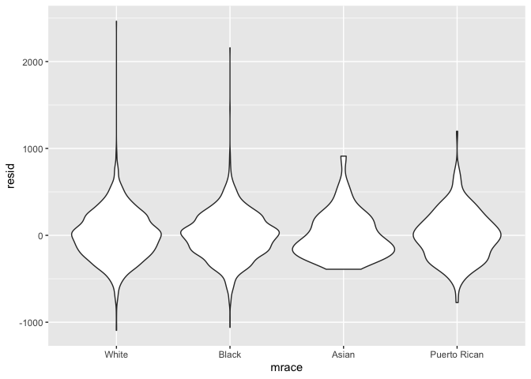
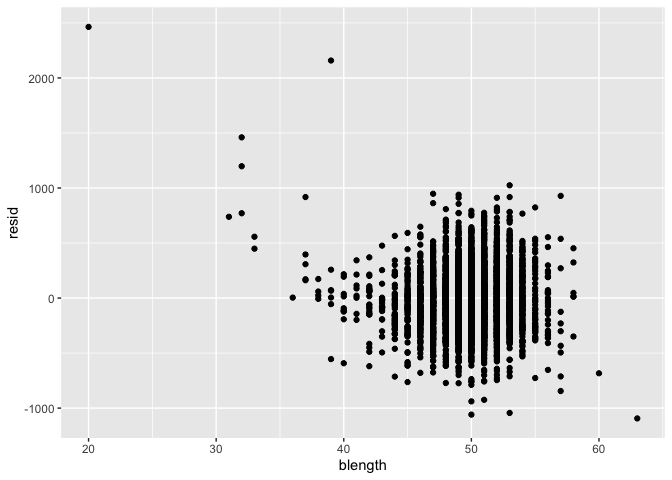

Homework 6
================
Lauren Richter
2021-12-04

## Problem 1

For the birthweight data set, a brief data dictionary is below:

-   `babysex`: baby’s sex (male = 1, female = 2)
-   `bhead`: baby’s head circumference at birth (centimeters)
-   `blength`: baby’s length at birth (centimeteres)
-   `bwt`: baby’s birth weight (grams)
-   `delwt`: mother’s weight at delivery (pounds)
-   `fincome`: family monthly income (in hundreds, rounded)
-   `frace`: father’s race (1 = White, 2 = Black, 3 = Asian, 4 = Puerto
    Rican, 8 = Other, 9 = Unknown)
-   `gaweeks`: gestational age in weeks
-   `malform`: presence of malformations that could affect weight (0 =
    absent, 1 = present)
-   `menarche`: mother’s age at menarche (years)
-   `mheight`: mother’s height (inches)
-   `momage`: mother’s age at delivery (years)
-   `mrace`: mother’s race (1 = White, 2 = Black, 3 = Asian, 4 = Puerto
    Rican, 8 = Other)
-   `parity`: number of live births prior to this pregnancy
-   `pnumlbw`: previous number of low birth weight babies
-   `pnumsga`: number of prior small for gestational age babies
-   `ppbmi`: mother’s pre-pregnancy BMI
-   `ppwt`: mother’s pre-pregnancy weight (pounds)
-   `smoken`: average number of cigarettes smoked per day during
    pregnancy
-   `wtgain`: mother’s weight gain during pregnancy (pounds)

``` r
bw_data = read_csv("data/birthweight.csv") %>%
  janitor::clean_names("snake") %>%
  mutate(babysex = as_factor(babysex),
         frace = as_factor(frace), 
         mrace = as_factor(mrace)) %>%
  mutate(babysex = recode_factor(babysex, 
                                 "1" = "male", 
                                 "2" = "female"),
         frace = recode_factor(frace, 
                               "1" = "White", 
                               "2" = "Black", 
                               "3" = "Asian", 
                               "4" = "Puerto Rican", 
                               "8" = "Other", 
                               "9" = "Unknown"),
         mrace = recode_factor(mrace, 
                               "1" = "White", 
                               "2" = "Black", 
                               "3" = "Asian", 
                               "4" = "Puerto Rican", 
                               "8" = "Other"))
## Rows: 4342 Columns: 20
## ── Column specification ────────────────────────────────────────────────────────
## Delimiter: ","
## dbl (20): babysex, bhead, blength, bwt, delwt, fincome, frace, gaweeks, malf...
## 
## ℹ Use `spec()` to retrieve the full column specification for this data.
## ℹ Specify the column types or set `show_col_types = FALSE` to quiet this message.

elim_cols = bw_data %>% 
  select(where(~n_distinct(.) == 1)) %>%
  colnames()

bw_data = bw_data %>%
  select(where(~n_distinct(.) > 1))

#skimr::skim(bw_data)

# check for the number of missing variables using
# sum(is.na(bw_data))
```

Data tidying involved name cleaning, variable conversion, and checking
for missing data. Variable names were cleaned to ensure they were
consistent. The variables `babysex`, `frace`, `mrace` were converted
from numeric to factor variables. Variables with only one unique value
were removed from analysis: `pnumlbw`, `pnumsga`. There were 0 missing
variables in the data set.

Propose a regression model for birthweight. This model may be based on a
hypothesized structure for the factors that underly birthweight, on a
data-driven model-building process, or a combination of the two.
Describe your modeling process and show a plot of model residuals
against fitted values – use add_predictions and add_residuals in making
this plot.

The proposed model for birth weight includes the baby’s sex assigned at
birth (SAB), birth length (cm), birth head circumference (cm),
gestational age (GA) in weeks,

``` r
mod_all_vars = lm(bwt ~ . -wtgain, data = bw_data, na.action = na.omit)

mod_all_vars_r2 = mod_all_vars %>%
  broom::glance() %>%
  pull(r.squared)

mod_all_vars %>%
  broom::tidy() %>%
  select(term, estimate, p.value) %>% 
  #mutate(term = str_replace(term, "^borough", "Borough: ")) %>% 
  knitr::kable(digits = 3)
```

| term              |  estimate | p.value |
|:------------------|----------:|--------:|
| (Intercept)       | -6265.391 |   0.000 |
| babysexfemale     |    28.707 |   0.001 |
| bhead             |   130.778 |   0.000 |
| blength           |    74.954 |   0.000 |
| delwt             |     4.101 |   0.000 |
| fincome           |     0.290 |   0.107 |
| fraceBlack        |    14.331 |   0.756 |
| fraceAsian        |    21.236 |   0.759 |
| fracePuerto Rican |   -46.996 |   0.293 |
| fraceOther        |     4.297 |   0.954 |
| gaweeks           |    11.549 |   0.000 |
| malform           |     9.765 |   0.890 |
| menarche          |    -3.551 |   0.220 |
| mheight           |     9.787 |   0.343 |
| momage            |     0.759 |   0.534 |
| mraceBlack        |  -151.435 |   0.001 |
| mraceAsian        |   -91.387 |   0.204 |
| mracePuerto Rican |   -56.479 |   0.211 |
| parity            |    95.541 |   0.018 |
| ppbmi             |     4.354 |   0.770 |
| ppwt              |    -3.472 |   0.184 |
| smoken            |    -4.854 |   0.000 |

To build a proposed model for birth weight, first all remaining
variables except for `wtgain` (due to expected colinearity with `delwt`
and `ppwt`) were examined to determine the p-value of the estimate. The
remaining variables explain \~71.8% of the variance in the birth
weights.

``` r
# bwt = babysex, blength, bhead, gaweeks, malform, smoken wtgain
fit = lm(bwt ~ babysex + blength + bhead + gaweeks + malform + smoken + wtgain + fincome + mrace + frace + mrace*fincome + blength*gaweeks, data = bw_data)

fit %>%
  broom::glance()
## # A tibble: 1 × 12
##   r.squared adj.r.squared sigma statistic p.value    df  logLik    AIC    BIC
##       <dbl>         <dbl> <dbl>     <dbl>   <dbl> <dbl>   <dbl>  <dbl>  <dbl>
## 1     0.714         0.712  275.      567.       0    19 -30534. 61111. 61245.
## # … with 3 more variables: deviance <dbl>, df.residual <int>, nobs <int>

fit %>%
  broom::tidy() %>%
  select(term, estimate, p.value) %>% 
  #mutate(term = str_replace(term, "^borough", "Borough: ")) %>% 
  knitr::kable(digits = 3)
```

| term                      |  estimate | p.value |
|:--------------------------|----------:|--------:|
| (Intercept)               | -5046.328 |   0.000 |
| babysexfemale             |    31.784 |   0.000 |
| blength                   |    62.979 |   0.000 |
| bhead                     |   134.012 |   0.000 |
| gaweeks                   |    -6.818 |   0.684 |
| malform                   |     9.051 |   0.899 |
| smoken                    |    -4.427 |   0.000 |
| wtgain                    |     3.879 |   0.000 |
| fincome                   |     0.952 |   0.000 |
| mraceBlack                |  -115.113 |   0.018 |
| mraceAsian                |   -20.835 |   0.845 |
| mracePuerto Rican         |   -23.400 |   0.714 |
| fraceBlack                |    39.940 |   0.390 |
| fraceAsian                |    38.515 |   0.582 |
| fracePuerto Rican         |   -36.626 |   0.416 |
| fraceOther                |     6.875 |   0.927 |
| fincome:mraceBlack        |    -1.389 |   0.000 |
| fincome:mraceAsian        |    -2.623 |   0.160 |
| fincome:mracePuerto Rican |    -1.661 |   0.178 |
| blength:gaweeks           |     0.368 |   0.281 |

``` r

modelr::add_residuals(bw_data, fit) %>%
  ggplot(aes(x = mrace, y = resid)) + geom_violin()
```

<!-- -->

``` r
modelr::add_residuals(bw_data, fit) %>%
  ggplot(aes(x = blength, y = resid)) + geom_point()
```

<!-- -->

Propose a regression model for birthweight. This model may be based on a
hypothesized structure for the factors that underly birthweight, on a
data-driven model-building process, or a combination of the two.
Describe your modeling process and show a plot of model residuals
against fitted values – use add_predictions and add_residuals in making
this plot.

Compare your model to two others:

One using length at birth and gestational age as predictors (main
effects only)

``` r
# bwt = B*length + C*GA
```

One using head circumference, length, sex, and all interactions
(including the three-way interaction) between these

``` r
# bwt = B*hc + C*length + D*sex + E*hc*length*sex + F*hc*length + G*hc*sex + H*length*sex
```

Make this comparison in terms of the cross-validated prediction error;
use crossv_mc and functions in purrr as appropriate.

Note that although we expect your model to be reasonable, model building
itself is not a main idea of the course and we don’t necessarily expect
your model to be “optimal”.

## Problem 2

For this problem, we’ll use the 2017 Central Park weather data that
we’ve seen elsewhere. The code chunk below (adapted from the course
website) will download these data.

``` r
weather_df = 
  rnoaa::meteo_pull_monitors(
    c("USW00094728"),
    var = c("PRCP", "TMIN", "TMAX"), 
    date_min = "2017-01-01",
    date_max = "2017-12-31") %>%
  mutate(
    name = recode(id, USW00094728 = "CentralPark_NY"),
    tmin = tmin / 10,
    tmax = tmax / 10) %>%
  select(name, id, everything())
## Registered S3 method overwritten by 'hoardr':
##   method           from
##   print.cache_info httr
## using cached file: ~/Library/Caches/R/noaa_ghcnd/USW00094728.dly
## date created (size, mb): 2021-12-03 19:33:05 (7.614)
## file min/max dates: 1869-01-01 / 2021-11-30
```

The boostrap is helpful when you’d like to perform inference for a
parameter / value / summary that doesn’t have an easy-to-write-down
distribution in the usual repeated sampling framework. We’ll focus on a
simple linear regression with `tmax` as the response and `tmin` as the
predictor, and are interested in the distribution of two quantities
estimated from these data:

r̂2 log(β̂0∗β̂1)

Use 5000 bootstrap samples and, for each bootstrap sample, produce
estimates of these two quantities. Plot the distribution of your
estimates, and describe these in words. Using the 5000 bootstrap
estimates, identify the 2.5% and 97.5% quantiles to provide a 95%
confidence interval for r̂2 and log(β̂0∗β̂1) . Note: `broom::glance()` is
helpful for extracting r̂2 from a fitted regression, and `broom::tidy()`
(with some additional wrangling) should help in computing log(β̂0∗β̂1) .
