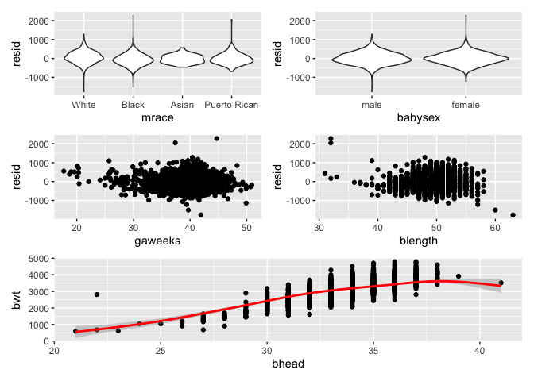
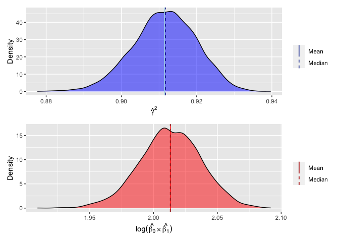

Homework 6
================
Lauren Richter
2021-12-04

## Problem 1

For the birthweight data set, a brief data dictionary is below:

-   `babysex`: baby’s sex (male = 1, female = 2)
-   `bhead`: baby’s head circumference at birth (centimeters)
-   `blength`: baby’s length at birth (centimeteres)
-   `bwt`: baby’s birth weight (grams)
-   `delwt`: mother’s weight at delivery (pounds)
-   `fincome`: family monthly income (in hundreds, rounded)
-   `frace`: father’s race (1 = White, 2 = Black, 3 = Asian, 4 = Puerto
    Rican, 8 = Other, 9 = Unknown)
-   `gaweeks`: gestational age in weeks
-   `malform`: presence of malformations that could affect weight (0 =
    absent, 1 = present)
-   `menarche`: mother’s age at menarche (years)
-   `mheight`: mother’s height (inches)
-   `momage`: mother’s age at delivery (years)
-   `mrace`: mother’s race (1 = White, 2 = Black, 3 = Asian, 4 = Puerto
    Rican, 8 = Other)
-   `parity`: number of live births prior to this pregnancy
-   `pnumlbw`: previous number of low birth weight babies
-   `pnumsga`: number of prior small for gestational age babies
-   `ppbmi`: mother’s pre-pregnancy BMI
-   `ppwt`: mother’s pre-pregnancy weight (pounds)
-   `smoken`: average number of cigarettes smoked per day during
    pregnancy
-   `wtgain`: mother’s weight gain during pregnancy (pounds)

``` r
bw_data_df = read_csv("data/birthweight.csv") %>%
  janitor::clean_names("snake") %>%
  mutate(babysex = as_factor(babysex),
         frace = as_factor(frace), 
         mrace = as_factor(mrace)) %>%
  mutate(babysex = recode_factor(babysex, 
                                 "1" = "male", 
                                 "2" = "female"),
         frace = recode_factor(frace, 
                               "1" = "White", 
                               "2" = "Black", 
                               "3" = "Asian", 
                               "4" = "Puerto Rican", 
                               "8" = "Other", 
                               "9" = "Unknown"),
         mrace = recode_factor(mrace, 
                               "1" = "White", 
                               "2" = "Black", 
                               "3" = "Asian", 
                               "4" = "Puerto Rican", 
                               "8" = "Other"))
## Rows: 4342 Columns: 20
## ── Column specification ────────────────────────────────────────────────────────
## Delimiter: ","
## dbl (20): babysex, bhead, blength, bwt, delwt, fincome, frace, gaweeks, malf...
## 
## ℹ Use `spec()` to retrieve the full column specification for this data.
## ℹ Specify the column types or set `show_col_types = FALSE` to quiet this message.

elim_cols = bw_data_df %>% 
  select(where(~n_distinct(.) == 1)) %>%
  colnames()

bw_data_df = bw_data_df %>%
  select(where(~n_distinct(.) > 1))

#skimr::skim(bw_data_df)

# check for the number of missing variables using
# sum(is.na(bw_data_df))
```

Data tidying involved name cleaning, variable conversion, and checking
for missing data. Variable names were cleaned to ensure they were
consistent. The variables `babysex`, `frace`, `mrace` were converted
from numeric to factor variables. Variables with only one unique value
were removed from analysis: `pnumlbw`, `pnumsga`. There were 0 missing
variables in the data set.

``` r
# build a linear model with everything except wtgain
all_vars_mod = lm(bwt ~ . -wtgain, data = bw_data_df)

# get r2 value
all_vars_mod_r2 = all_vars_mod %>%
  broom::glance() %>%
  pull(adj.r.squared)

# select only vars with effect size > 10 g and p < 0.05
# also select smoking status and maternal race

incl_vars = all_vars_mod %>%
  broom::tidy() %>%
  select(term, estimate, p.value) %>% 
  filter(
    ((abs(estimate) >= 100) & (p.value <= 0.05) & (term != "(Intercept)"))
    | (grepl("babysex", term)) 
    | (grepl("blength", term))
    | (grepl("gaweeks", term))
    | (grepl("mrace", term))
    | grepl("smoken", term)) %>%
  pull(term) %>%
  str_replace(.,"mrace.*", "mrace") %>%
  str_replace(.,"babysex.*","babysex") %>%
  unique()
```

To build the proposed model, first, knowledge of variables known to
correlate with birth weight were included: baby’s sex assigned at birth
(`babysex`), birth length (`blength`), birth head circumference
(`bhead`), gestational age (`gaweeks`), and maternal smoking status
(`smoken`).

In order to support these hypothesized variables with a data-driven
approach, all variables except for `wtgain` (due to expected colinearity
with `delwt` and `ppwt`) were examined in a linear model to determine
the effect size and p-values of the estimates. These remaining variables
explain \~71.7% of the variance in the birth weights.

Next, variables were filtered to only include those with absolute effect
sizes \>= 100 grams and p-values \< 0.05. Variables that are reported to
correlate with birth weight but did not meet these criteria were
excluded, with the exception of `babysex`, which was included as a
modifier.

The final variables included in the proposed model were `babysex`,
`bhead`, `blength`, `gaweeks`, `mrace`, `smoken`.

Although many of the variables may not have a linear relationship, and
the relationship seems to vary by sex and maternal race (see below), to
reduce complexity, a generalized linear model was used.

``` r
hc_v_wt_plt = bw_data_df %>%
  ggplot(aes(x = bhead, y = bwt, color = mrace)) + 
  geom_point(alpha = 0.5) + 
  facet_wrap(~babysex)

ga_v_wt_plt = bw_data_df %>%
  ggplot(aes(x = gaweeks, y = bwt, color = mrace)) + 
  geom_point(alpha = 0.5) + 
  facet_wrap(~babysex)

hc_v_wt_plt / ga_v_wt_plt
```

<!-- -->

After variable selection, the data were split into training and test
sets (using 80/20 rule) to train a simple linear model. Select residuals
are plotted below showing that the model does not appear to have a
constant error for each variable, which is expected given that many of
the variables are not linearly related. Plotting predictions of birth
weight vs. birth head circumference (red, bottom panel) reveals
overfitting in that the error increases at lower head circumferences.

``` r
# bwt = f(babysex, blength, bhead, gaweeks, smoken, mrace)

train_df = sample_n(bw_data_df, round(nrow(bw_data_df)*0.8))
test_df = anti_join(bw_data_df, train_df)
## Joining, by = c("babysex", "bhead", "blength", "bwt", "delwt", "fincome", "frace", "gaweeks", "malform", "menarche", "mheight", "momage", "mrace", "parity", "ppbmi", "ppwt", "smoken", "wtgain")

bw_mod = glm(bwt ~ babysex + blength + bhead + gaweeks + smoken + babysex*gaweeks*mrace, data = train_df)

resid_mrace_bw = modelr::add_residuals(train_df, bw_mod) %>%
  ggplot(aes(x = mrace, y = resid)) + geom_violin()

resid_sex_bw = modelr::add_residuals(train_df, bw_mod) %>%
  ggplot(aes(x = babysex, y = resid)) + geom_violin()

resid_ga_bw = modelr::add_residuals(train_df, bw_mod) %>%
  ggplot(aes(x = gaweeks, y = resid)) + geom_point()

resid_len_bw = modelr::add_residuals(train_df, bw_mod) %>%
  ggplot(aes(x = blength, y = resid)) + geom_point()

train_pred_bw = train_df %>%
  add_predictions(bw_mod) %>%
  ggplot(aes(x = bhead, y = bwt)) + geom_point() + 
  geom_smooth(aes(y = pred), color = "red")

((resid_mrace_bw + resid_sex_bw) / (resid_ga_bw + resid_len_bw)) / train_pred_bw
## `geom_smooth()` using method = 'gam' and formula 'y ~ s(x, bs = "cs")'
```

<!-- -->

Compared to a linear model including only main effects of birth length
and gestational age, the difference in residuals is statistically
significant, with the more complex model having a lower residual sum of
squares (RSS).

``` r
# nested model
# bwt = f(blength, gaweeks)

lvg_mod = lm(bwt ~ blength + gaweeks, data = train_df)

anova(lvg_mod, bw_mod) %>% 
  broom::tidy()
## # A tibble: 2 × 6
##   res.df        rss    df      sumsq statistic    p.value
##    <dbl>      <dbl> <dbl>      <dbl>     <dbl>      <dbl>
## 1   3471 366060042.    NA        NA       NA   NA        
## 2   3455 255053365.    16 111006677.      94.0  1.83e-256

resid_mrace_lvg = modelr::add_residuals(train_df, lvg_mod) %>%
  ggplot(aes(x = mrace, y = resid)) + geom_violin()

resid_ga_lvg = modelr::add_residuals(train_df, lvg_mod) %>%
  ggplot(aes(x = gaweeks, y = resid)) + geom_point()

resid_sex_lvg = modelr::add_residuals(train_df, lvg_mod) %>%
  ggplot(aes(x = babysex, y = resid)) + geom_violin()

resid_len_lvg = modelr::add_residuals(train_df, lvg_mod) %>%
  ggplot(aes(x = blength, y = resid)) + geom_point()

train_pred_lvg = train_df %>%
  add_predictions(lvg_mod) %>%
  ggplot(aes(x = bhead, y = bwt)) + geom_point() + 
  geom_smooth(aes(y = pred), color = "red")

((resid_mrace_lvg + resid_sex_lvg) / (resid_ga_lvg + resid_len_lvg)) / train_pred_lvg
## `geom_smooth()` using method = 'gam' and formula 'y ~ s(x, bs = "cs")'
```

<!-- -->

Compared to another model using head circumference, length, sex, and all
interactions (including the three-way interaction), the proposed model
also appears to perform better with a lower RMSE.

``` r
# bwt = f(hc, length, sex, hc*length, hc*sex, length*sex, hc*length*sex)

hc_mixed_mod = lm(bwt ~ bhead*babysex*blength, data = train_df)

resid_mrace_hc = modelr::add_residuals(train_df, hc_mixed_mod) %>%
  ggplot(aes(x = mrace, y = resid)) + geom_violin()

resid_ga_hc = modelr::add_residuals(train_df, hc_mixed_mod) %>%
  ggplot(aes(x = gaweeks, y = resid)) + geom_point()

resid_sex_hc = modelr::add_residuals(train_df, hc_mixed_mod) %>%
  ggplot(aes(x = babysex, y = resid)) + geom_violin()

resid_len_hc = modelr::add_residuals(train_df, hc_mixed_mod) %>%
  ggplot(aes(x = blength, y = resid)) + geom_point()

train_pred_hc = train_df %>%
  add_predictions(hc_mixed_mod) %>%
  ggplot(aes(x = bhead, y = bwt)) + geom_point() + 
  geom_smooth(aes(y = pred), color = "red")

((resid_mrace_hc + resid_sex_hc) / (resid_ga_hc + resid_len_hc)) / train_pred_hc
## `geom_smooth()` using method = 'gam' and formula 'y ~ s(x, bs = "cs")'
```

<!-- -->

Comparing all three linear models side by side using cross validation
demonstrates the slightly improved performance of the proposed model
compared to the simplified models with respect to RMSE.

``` r
train_pred_all = train_df %>% 
  gather_predictions(bw_mod, lvg_mod, hc_mixed_mod) %>% 
  mutate(model = fct_inorder(model)) %>% 
  ggplot(aes(x = bhead, y = bwt)) + 
  geom_point(alpha = .5) +
  geom_smooth(aes(y = pred), color = "red") + 
  facet_grid(~model)

cv_df =
  crossv_mc(bw_data_df, 100) %>% 
  mutate(
    train = map(train, as_tibble),
    test = map(test, as_tibble))

cv_df = 
  cv_df %>% 
  mutate(
    bw_mod = map(train, ~glm(bwt ~ babysex + blength + bhead + gaweeks + smoken + babysex*gaweeks*mrace, data = .x)),
    lvg_mod = map(train, ~lm(bwt ~ blength + gaweeks, data = .x)),
    hc_mixed_mod= map(train, ~lm(bwt ~ bhead*babysex*blength, data = .x))) %>% 
  mutate(
    rmse_bw = map2_dbl(bw_mod, test, ~rmse(model = .x, data = .y)),
    rmse_lvg = map2_dbl(lvg_mod, test, ~rmse(model = .x, data = .y)),
    rmse_hc = map2_dbl(hc_mixed_mod, test, ~rmse(model = .x, data = .y)))

cv_plot = cv_df %>% 
  select(starts_with("rmse")) %>% 
  pivot_longer(
    everything(),
    names_to = "model", 
    values_to = "rmse",
    names_prefix = "rmse_") %>% 
  mutate(model = fct_inorder(model)) %>% 
  ggplot(aes(x = model, y = rmse)) + geom_violin()

train_pred_all / cv_plot
## `geom_smooth()` using method = 'gam' and formula 'y ~ s(x, bs = "cs")'
```

<!-- -->

## Problem 2

As previously stated, the code below will download 2017 Central Park
weather data.

``` r
weather_df = 
  rnoaa::meteo_pull_monitors(
    c("USW00094728"),
    var = c("PRCP", "TMIN", "TMAX"), 
    date_min = "2017-01-01",
    date_max = "2017-12-31") %>%
  mutate(
    name = recode(id, USW00094728 = "CentralPark_NY"),
    tmin = tmin / 10,
    tmax = tmax / 10) %>%
  select(name, id, everything())
## Registered S3 method overwritten by 'hoardr':
##   method           from
##   print.cache_info httr
## using cached file: ~/Library/Caches/R/noaa_ghcnd/USW00094728.dly
## date created (size, mb): 2021-12-03 19:33:05 (7.614)
## file min/max dates: 1869-01-01 / 2021-11-30
```

The values of *r̂*<sup>2</sup> and
*l**o**g*(*β*<sub>0</sub>\**β*<sub>1</sub>) were pulled and calculated
by unnesting the `broom::glance()` and `broom::tidy()` functions,
respectively. These were plotted with the resulting densities
demonstrating that the sample approximates a normal distribution (mean ≈
median).

The following equation was used to calculate the 2.5% and 97.5%iles to
generate a 95% confidence interval:

*X̄* ± *t*<sub>(*α*/2), *d**f*<sub>(*N*−1)</sub></sub>*S*<sub>*X̄*</sub>,
where ${S\_{\\bar X}} = \\frac{s}{{\\sqrt N }}$ (standard error)

This equation was embedded in a function and then applied to each
variable individually.

``` r
# let's make some functions to calculate stats

std_error = function (x) {
  sd(x)/sqrt(length(x))
}

# calculate the confidence interval

get_ci = function (x, pct_conf = 95) {
  mean_ = mean(x)
  se_ = std_error(x)
  alpha_ = 1-(pct_conf/100)
  df_ = length(x) - 1
  t_ = qt(p = alpha_/2, df = df_)
  low_quant = mean_ - (t_*se_)
  high_quant = mean_ + (t_*se_)
  results_ = c(pct_conf, mean_, low_quant, high_quant)
  res_info = names(results_) <- c("% Confidence", "Mean", paste0((100-pct_conf)/2, "%ile"), paste0(100-((100-pct_conf)/2), "%ile"))
  paste(res_info)
  return(results_)
}

boot_df = weather_df %>% 
  modelr::bootstrap(n = 5000) %>% 
  mutate(
    models = map(strap, ~lm(tmax ~ tmin, data = .x)),
    results = map(models, broom::tidy),
    r2 = map(models, broom::glance)) %>% 
  select(-strap, -models) %>%
  unnest(c(r2, results), names_repair = "universal") %>%
  janitor::clean_names() %>%
  select(id, term, estimate, r_squared) %>%
  pivot_wider(names_from = term, values_from = estimate) %>%
  rename("b0" = "(Intercept)",
         "b1_tmin" = "tmin") %>%
  mutate(log_b0_b1= log((b0*b1_tmin))) %>%
  select(r_squared, log_b0_b1)
## New names:
## * statistic -> statistic...5
## * p.value -> p.value...6
## * statistic -> statistic...10
## * p.value -> p.value...11

sapply(boot_df, get_ci)
##               r_squared log_b0_b1
## % Confidence 95.0000000 95.000000
## Mean          0.9115131  2.012652
## 2.5%ile       0.9117490  2.013318
## 97.5%ile      0.9112772  2.011987
  
             

r2_dens = boot_df %>%
  ggplot(aes(x=r_squared)) + geom_density(alpha = 0.5, fill = "blue") +
  geom_vline(aes(xintercept=mean(r_squared)),
            color="lightblue", linetype="solid", size=0.5, show.legend = TRUE) +
  geom_vline(aes(xintercept=median(r_squared)),
            color="darkblue", linetype="dashed", size=0.5, show.legend = TRUE) +
  labs(y = "Density", x = expression(hat(r)^2)) +
  scale_color_manual(name = '', 
                     labels = c(mean = 'Mean', median = 'Median'),
                     values = c(mean = 'black', median = 'black')) +
  guides(color = guide_legend(override.aes = list(linetype = c('solid','dashed'))),
         linetype = none)


logb_dens = boot_df %>%
  ggplot(aes(x=log_b0_b1)) + geom_density(alpha = 0.5, fill = "red") + 
  geom_vline(aes(xintercept=mean(log_b0_b1)), show.legend = TRUE,
            color="red", linetype="solid", size=0.5) +
  geom_vline(aes(xintercept=median(log_b0_b1)), show.legend = TRUE,
            color="darkred", linetype="dashed", size=0.5) +
  labs(y = "Density", x = expression(log(beta[0]%*%beta[1]))) +
  scale_color_manual(name = '', 
                     labels = c(mean = 'Mean', median = 'Median'),
                     values = c(mean = 'black', median = 'black')) +
  guides(color = guide_legend(override.aes = list(linetype = c('solid','dashed'))),
         linetype = none)

r2_dens + logb_dens
```

<!-- -->
